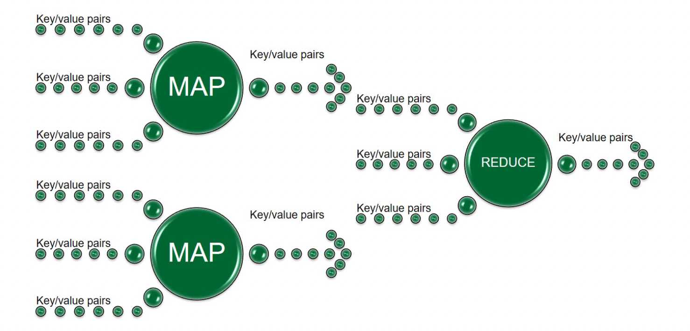
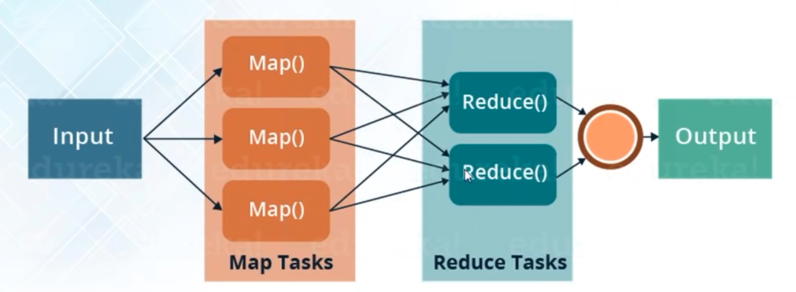

# Log analyser using MapReduce
#### Name: Amey Kasbe
#### UIN: 674285381
#### Email: akasbe2@uic.edu

## Project Description
The intention of the project is to analyse log data generated by [LogFileGenerator](https://github.com/0x1DOCD00D/LogFileGenerator). MapReduce jobs are created for parallel processing of the log files. Each MapReduce job performs a targetted analysis of logs. The jobs are described as - 

### Job 1
Create a file in comma separated format with distribution of message types in logs with messages of a particular pattern across predefined time interval.

### Job 2
Create a file in comma separated format with distribution of message types in logs with messages of a particular pattern across predefined time interval.

### Job 3
Create a file in comma separated format with distribution of message types in logs with messages of a particular pattern.

### Job 4
Create a file in comma separated format with number of characters in each log message for each log message type that contain the highest number of characters in the detected instances of the designated regex pattern.

## MapReduce Architecture

* MapReduce facilitates the parallel processing of a large dataset by splitting it into smaller chunks of data and processing these chunks in parallel in different computing nodes.
* By parallel processing, the big data that would take years to process on a monolithic computing system can be processed in reasonable time.
* This is possible when the subsets of the dataset are disjoint i.e. the data when divided into subsets are independent from one another other, which means if operation on one subset does not require any information from the operation from other, can be processed in parallel.
* MapReduce model can be implemented on such datasets which can be processed in parallel.

### Mapper
* Mapper is a computing node that takes the chunks of data and converts it into an intermediate set of data, where the data is broken into individual key-value pairs.
* It accepts a key-value pair i.e. {key: value} and outputs a multiset of key-value pairs i.e. {key1: value1, key2: value2 ...}

### Reducer
* Reducer is a computing node that takes the output from mapper (maybe after some extra processing like shuffling) and combines the data (reduces) into smaller set of tuples. 
* It accepts a key-value pair such that value is a multiset i.e. {key: {value1, value2 ...}} and outputs a key-value pair such that the key is same as the input and the value is either a single value or a multiset of values i.e. {key: {value1, value2 ...}}

## Technologies used
### [Apache Hadoop](http://hadoop.apache.org/)
* A framework for distributed processing of large data sets across multiple computers (or even on a single node) using the map/reduce model. [5]
  
### [HortonBox](https://www.cloudera.com/downloads/hortonworks-sandbox.html)

* The Sandbox is a straightforward, pre-configured, learning environment that contains the latest developments from Apache Hadoop Enterprise, specifically Hortonworks Data Platform (HDP) Distribution. [6]
* The Sandbox comes packaged in a virtual environment that can run in the cloud or on your personal machine. [6]
* The Sandbox allows you to learn and explore HDP on your own. [6]

### [VMware Workstation Pro](https://www.vmware.com/products/workstation-pro.html)

* VMware Workstation Pro is a hosted hypervisor that runs on x64 versions of Windows and Linux operating systems
* It enables users to set up virtual machines on a single physical machine and use them simultaneously along with the host machine. [7]
#### Virtual Machine
* A virtual machine is a software computer that, like a physical computer, runs an operating system and applications.
* The virtual machine is backed by the physical resources of a host.
* Every virtual machine has virtual devices that provide the same functionality as physical hardware and have additional benefits in terms of portability, manageability, and security.

## Project files
Some important project files - 
### Execution.scala
The main method inside `Execution.scala` executes the jobs.

### Mappers & Reducers
#### `DistributionMapper.scala` & `DistributionReducer.scala`
Contains a mapper class and a reducer class respectively for the MapReduce Job 1: Distribution of message types in logs with messages of a particular pattern across predefined time interval.

#### `DistributionMapperNoTime.scala` & `DistributionReducerNoTime.scala`
Contains a mapper class and a reducer class respectively for the MapReduce Job 3: Distribution of message types in logs with messages of a particular pattern.

#### `MaxCharacterMapper.scala` & `MaxCharacterReducer.scala`
Contains a mapper class and a reducer class respectively for the MapReduce Job 4: Number of characters in each log message for each log message type that contain the highest number of characters in the detected instances of the designated regex pattern.

### Configuration
`application.conf` contains the configurations for the MapReduce Jobs. Mainly contains the -
* `intialTime` and `finalTime` defining the time interval for Job 1
* Regular expressions for message types like `INFO`, `ERROR`, `WARN` and `DEBUG` defined by `messageTypeRegex`.
* Regular expressions for searching time in logs defined by `timeRegex`.
* Regular expressions for searching the custom pattern in logs defined by `patternRegex`.

### Utilities
`parsingUtil.scala` contains a class with utility method that finds a pattern in a string using Regular Expression.

## Execution Process
### Prerequisites
* [Java 8](https://www.oracle.com/java/technologies/downloads/#java8-windows) - Apache Hadoop supports Java 8.
* [vmWare Workstation Pro](https://www.vmware.com/products/workstation-pro/workstation-pro-evaluation.html)
* [HortonBox](https://www.cloudera.com/downloads/hortonworks-sandbox/hdp.html?utm_source=mktg-tutorial)

### Create jar file
* Clone this repository.
* Open terminal, navigate to the root directory and create the jar file using command -   
  `sbt clean compile assembly`

### Local Environment Execution
#### Setup Hadoop Environment
* Load the HortonBox sandbox image in vmWare Workstation pro
* Start the virtual machine
* Access the Hadoop environment by HortonBox Ambari environment using web browser. The IP Address can be found in the VM.
* Access the VM using Putty with same IP address. Credentials would be hadoop/hadoop. You will be prompted to change the credentials.
* Create admin account on Ambari by command -  
`ambari-admin-password-reset`

#### Execute jar file
* Upload the jar file into the HDFS using Ambari dashboard interface.
* Access the VM using Terminal, GET the jar file into the VM using the command -  
`hadoop fs -get /path_to_jar/`
* Execute the jar file for EACH job - 
`hadoop jar <fileName>.jar Execution <jobNumber> <pathToInput> <pathToOutput>`

#### Output files
* Output files can be accessed inside the path given as argument. For each job a _jobN directory will be created.

## AWS Elastic MapReduce Execution
### Setup
* Sign In to Amazon Web Services

#### AWS EC2 (Elastic Compute Cloud)
* Navigate to AWS EC2
* On EC2 dashboard, on the left Panel search for Key-Pair
* Create a Key-Pair

#### AWS S3 (Simple Storage Service)
* Navigate to AWS S3
* Create an S3 bucket
* Upload the jar and log files in the S3 bucket created.

#### AWS EMR (Elastic MapReduce)
* Navigate to AWS EMR
* Create an EMR cluster 
  * Enter a name
  * Select the S3 bucket created earlier
  * Select the Key-Pair created earlier
* Wait till the cluster is ready
* Navigate to Steps tab under AWS EMR
* Add steps for individual jobs
  * Click on Add Step
  * Select the jar from AWS S3 uploaded earlier
  * Provide arguments in format  
    `Execution <JobNumber> <s3BucketInputLocation> <s3BucketOutputLocation>`
    Examples -  
  * Job 1  
    `Execution 1 s3://cs441-hw2-bucket/data/input s3://cs441-hw2-bucket/data/output`
  * Job 2  
    `Execution 2 s3://cs441-hw2-bucket/data/input s3://cs441-hw2-bucket/data/output`
  * Job 3  
    `Execution 3 s3://cs441-hw2-bucket/data/input s3://cs441-hw2-bucket/data/output`
  * Job 4  
    `Execution 4 s3://cs441-hw2-bucket/data/input s3://cs441-hw2-bucket/data/output`
  
## Unit testing procedure
### Using IntelliJ Idea
1. Clone this repository
2. Import the project in IntelliJ Idea
3. Run the `DistributedProcessingTestSuite` class from `DistributedProcessingTestSuite.scala`.

### By SBT test command
1. Clone this repository
2. Ensure necessary dependencies are installed
    * Java 8
    * Scala runtime
    * SBT
   etc.
3. In terminal, navigate to root path 
4. Execute -  
`sbt clean compile test`

## References
1. Dr. Grechanik, Mark, (2020) Cloud Computing: Theory and Practice.
2. [Apache Hadoop](http://hadoop.apache.org/)
3. [HortonBox](https://www.cloudera.com/downloads/hortonworks-sandbox.html)
4. [VMware Workstation Pro](https://www.vmware.com/products/workstation-pro.html)
5. [MapReduce Wikipedia](https://en.wikipedia.org/wiki/MapReduce)
6. http://indico.ictp.it/event/8170/session/10/contribution/21/material/0/1.pdf
7. [vmWare Wikipedia](https://en.wikipedia.org/wiki/VMware_Workstation)
8. [Edureka](https://www.youtube.com/c/edurekaIN) 
9. [TutorialsPoint](https://www.tutorialspoint.com/hadoop/hadoop_mapreduce.htm)